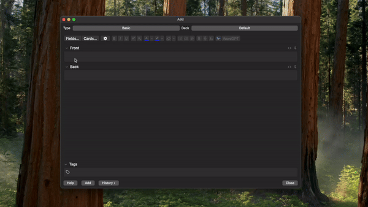

# WordGPT - AI-Powered Vocabulary Card Generator

A simple Anki add-on that automatically generates vocabulary cards using ChatGPT. 

## Features

- **Definition Generation**: Get auto-generated definitions for your vocabulary words
- **Synonym Integration**: Include relevant synonyms to expand your vocabulary understanding
- **Example Sentences**: Learn words in context with automatically generated example sentences

## How to Use

1. Open the card editor in Anki
2. Enter your word in the front field
3. Click the "WordGPT" button
4. The back of the card will be automatically populated with:
   - Definition
   - Synonyms (optional)
   - Example sentences (optional)

### Advanced Usage

You can get more specific definitions by:

1. **Specifying Part of Speech**:
   - Enter "light (n.)" vs "light (adj.)" for different parts of speech
2. **Specifying Context**:
   - Enter "bank (financial)" vs "bank (river)" for different contexts

This helps WordGPT generate more accurate and relevant definitions for your specific needs.

> **Note**: For ease of use, I've set up a backend service that uses my personal OpenAI API key for word generation. Depending on usage patterns, this arrangement may be revisited in the future.

## Configuration

Access the settings through Tools > "WordGPT Settings" to customize:
- Include/exclude synonyms
- Include/exclude example sentences

## Support

For issues or feature requests, feel free to comment on this add-on or open an issue in the [GitHub repository](https://github.com/jeongmincho/wordgpt/issues).

## License

This add-on is released under the MIT License.

---

Note: This add-on requires an internet connection to generate content.
